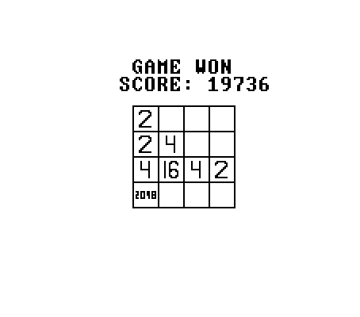
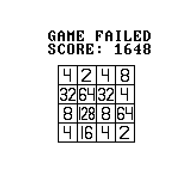

# 2048
Игра 2048 написанная на Jack    
В директории `src` - исходный код на Jack, в `vm` - скомпилрованный код     
Работу выполнили студенты 4 курса - Лифанов Фёдор, Хадыев Вячеслав 
## Управление
Клавиши `←`, `→`, `↑`, `↓` сдвигают цифры на поле в соответсвующую сторону      
Клавиша `R` позволяет перезапустить игру в любой момент активной игровой сессии     
Клавша `G` создаёт новую игру после выигрыша или проигрыша      
## Победа

## Беда
